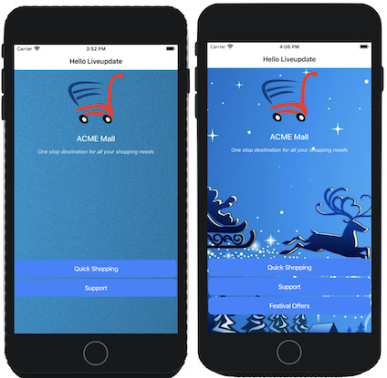
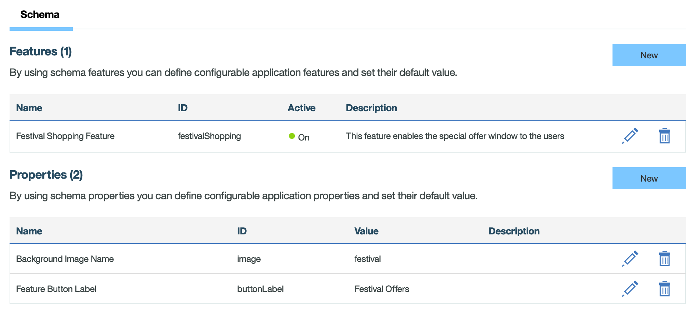

PSL Mobile Foundation
===
## Hello Live Update

In the sample application, User can roll feature and the properties remotely using Liveupdate Feature of MobileFirst Foundation

### Usage

1. From a command-line window, navigate to the project's root folder and run the following commands:
    - `ionic cordova platform add ios` or `ionic cordova platform add android`- to add a platform.
    - `mfpdev app register` - to register the application.
    - `mfpdev app push` - to add the `liveupdate.mobileclient` scope in scope elements mappings section of security.
   
2. Add Liveupdate Features & Properties as shown below in **MobileFirst Operations Console → [your application] → Liveupdate Settings → Schema**.

3. Run the application in an Android Emulator, iOS Simulator, Browser or physical device with the following command.
    - `ionic cordova run ios` or `ionic cordova run android` - to run the application. 

### Changing Live Update Settings

In **MobileFirst Operations Console → [your application] → Live Update Settings → Schema tab**

#### Feature Rollout
click on the **Edit** icon of  **festivalShopping**  feature under Features section and Change the default value to **On** or *Off** to enable/disable the feature remotely.
 
#### Feature Properties
* Click the **Edit** icon of **buttonLabel** under Properties section and change the value to update the feature properties remotely.

## Version
Ionic 7.0.0

## Supported Versions
PMF Foundation 8.0

## Licence
Copyright 2024 PSL Systems.

Licensed under the Apache License, Version 2.0 (the "License");
you may not use this file except in compliance with the License.
You may obtain a copy of the License at

http://www.apache.org/licenses/LICENSE-2.0

Unless required by applicable law or agreed to in writing, software
distributed under the License is distributed on an "AS IS" BASIS,
WITHOUT WARRANTIES OR CONDITIONS OF ANY KIND, either express or implied.
See the License for the specific language governing permissions and
limitations under the License.s
